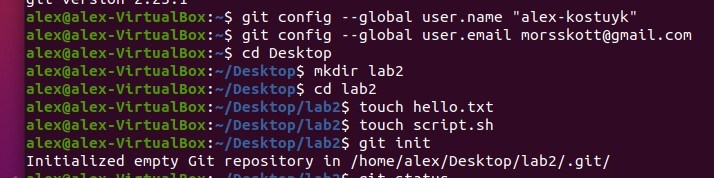
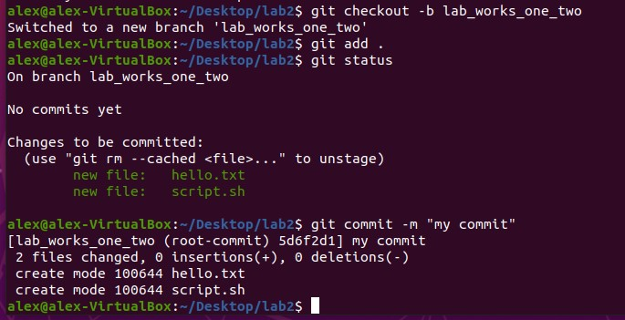
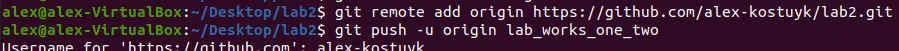
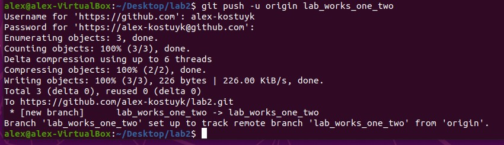

# Лабораторна робота №2. Основні команди системи контролю версій Git.

## План:
 1. Пройти гру Git Learn та зробити скріншоти пройдених рівнів.
 2. Зробити git init папки із файлом  hello.txt та bash скриптом.
 3. Зробити git commit.
 4. Зробити git push у віддалений репозиторій у вітку lab_works_one_two.
 5. Додати в файл Readme звіт до лабораторної, щоб його можна було передивлятись на репозиторію коли переходиш у вітку.

---
Виконав студент ІІІ курсу

Напрям ІПЗ, група 1.2

Костюк Олександр Анатолійович

---

### 1. Пройти гру Git Learn та зробити скріншоти пройдених рівнів.

### 2. Зробити git init папки із файлом  hello.txt та bash скриптом.

### 3. Зробити git commit.

### 4. Зробити git push у віддалений репозиторій у вітку lab_works_one_two.

### 5. Додати в файл Readme звіт до лабораторної, щоб його можна було передивлятись на репозиторію коли переходиш у вітку.

